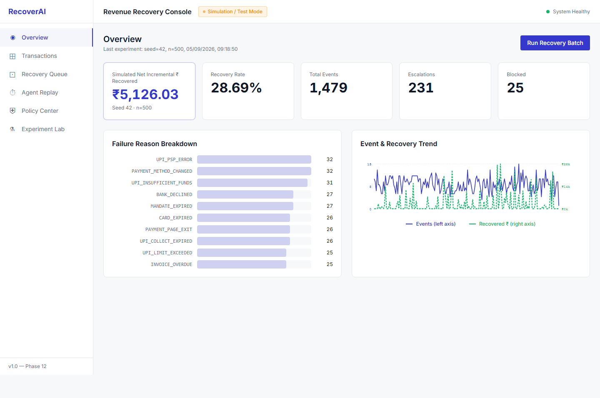
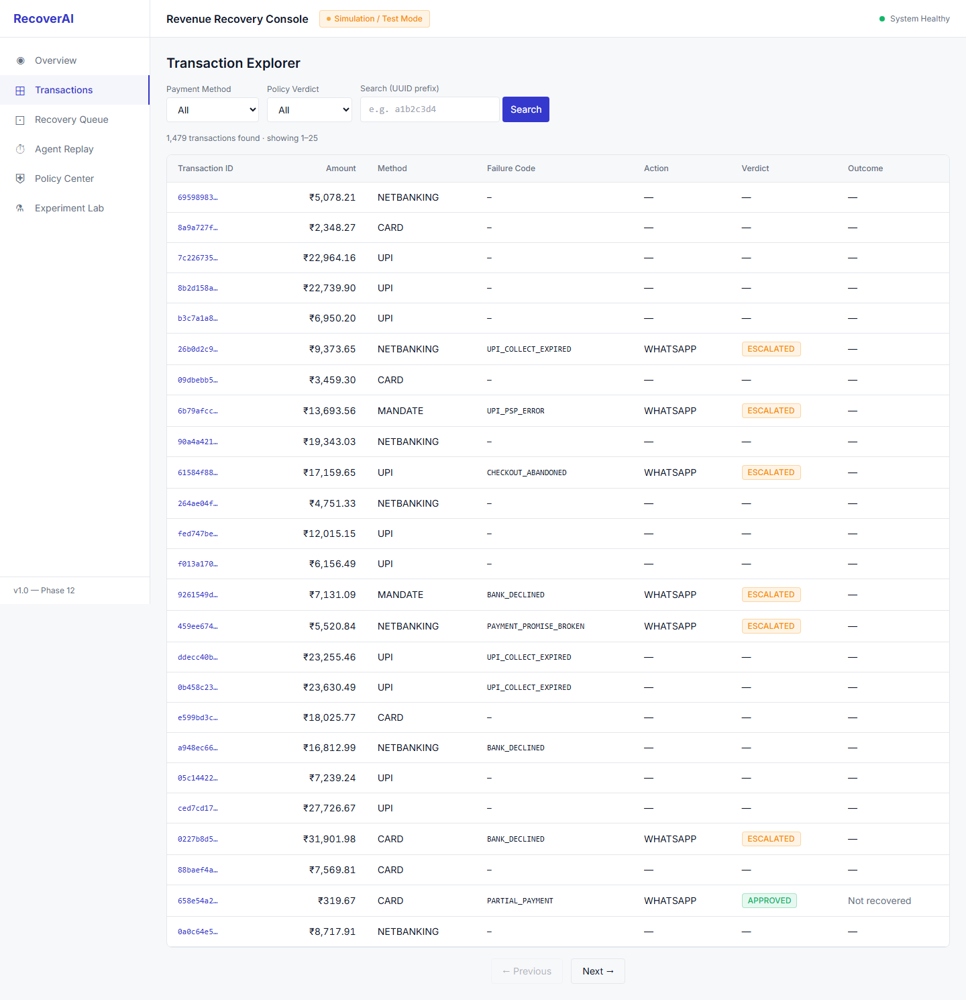
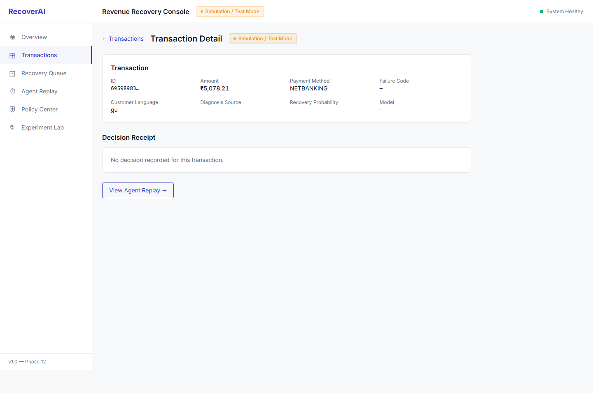
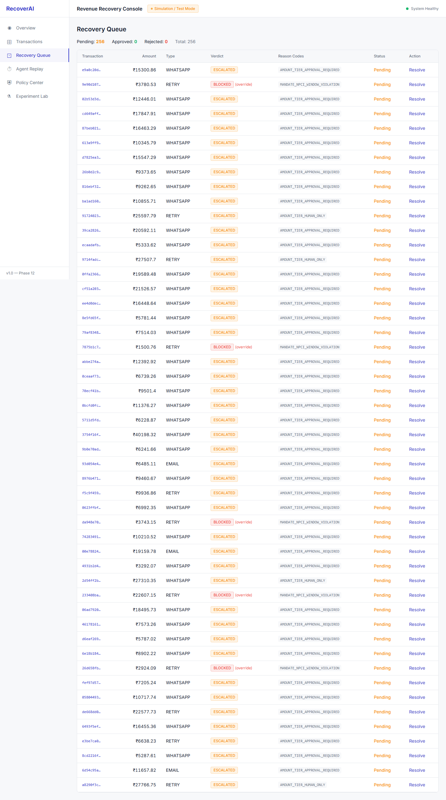
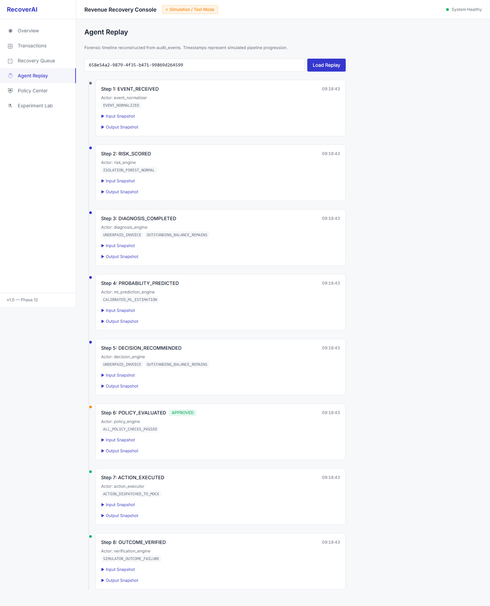
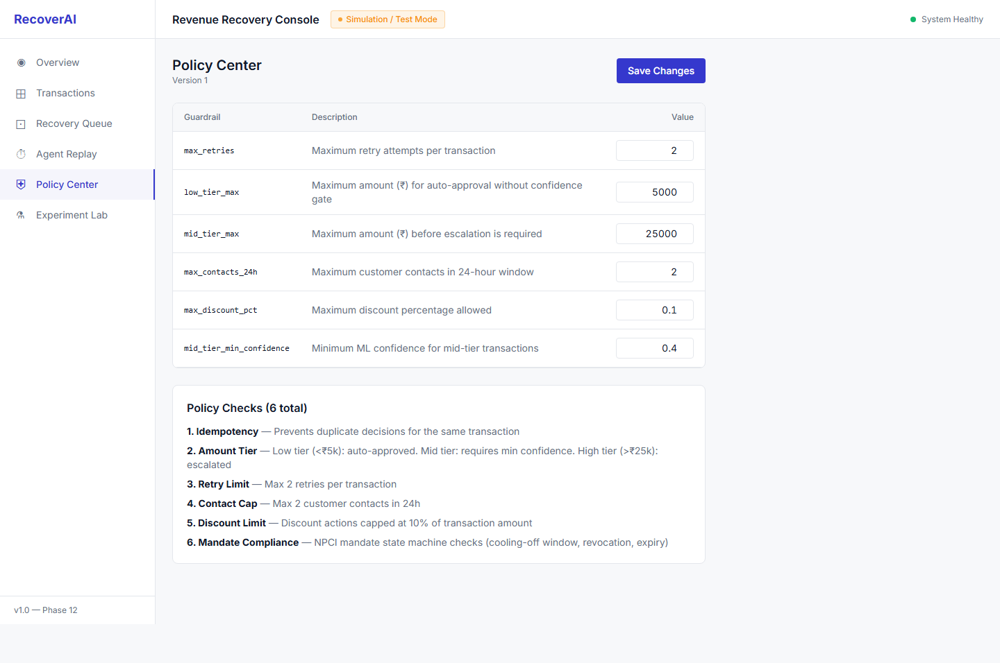
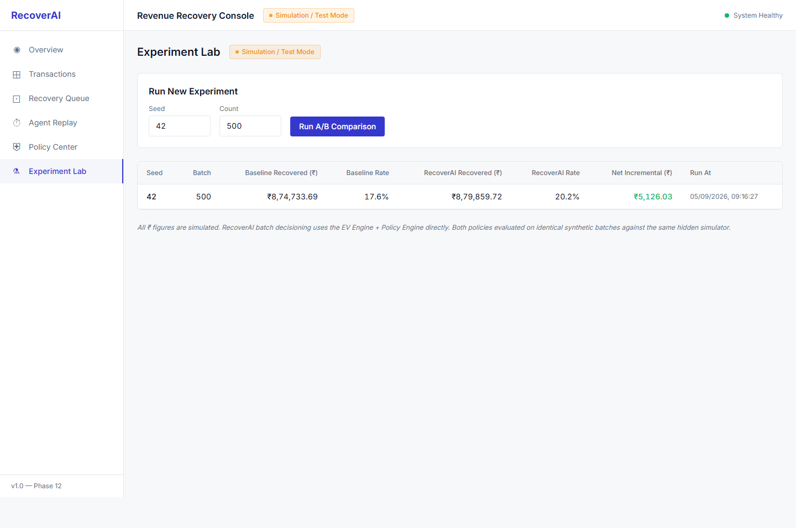

# RecoverAI — Complete System & Phase 12 Dashboard Walkthrough

**RecoverAI** is an agentic AI system that recovers failed recurring and checkout payments for Indian subscription businesses. The system couples an LLM reasoning layer with deterministic econometric expected-value verification and an authoritative deterministic policy engine.

---

## Architecture & Foundational Principles

```
  [ Payment Failure Event ]
              │
              ▼
    1. Risk Scoring (ML: Isolation Forest)
              │
              ▼
    2. Deterministic Rule-Based Diagnosis
              │
              ▼
    3. ML Recovery Probability (Gradient Boosting / Scikit-Learn)
              │
              ▼
    4. LLM Recommendation (Gemini 3.5 Flash Lite)
              │
              ▼
    5. Expected Value Verification (Econometric Formula Verification)
              │
              ▼
    6. Policy Engine Authorization (6 Authoritative Guardrails)
         ├── Pass: Execute Recovery Action
         ├── Escalate: Recovery Queue (Human Approval)
         └── Block: Guardrail Stoppage (No Action)
              │
              ▼
    7. Outcome Verification & Real-time Audit Trail (audit_events)
```

### Non-Negotiable Core Rules
1. **Zero Mock / Hardcoded Metrics**: All dashboard figures, tables, and charts are generated live by backend database queries.
2. **KPI Integrity**: The primary dashboard KPI (*"Simulated Net Incremental ₹ Recovered"*) is pulled directly from the `experiments` table for the active experiment, strictly preserving parity with Phase 9's verified cohort math.
3. **Simulation Disclaimers**: Every financial metric is explicitly labeled as simulated, accompanied by persistent `Simulation / Test Mode` badges.
4. **Separation of Concerns**: The LLM *recommends*; the Policy Engine *authorizes*. These are separate, distinctly colored, and independently audited stages.

---

## Phase 12: The 7 Dashboard Screens

### 1. Overview Screen
- **Primary KPI**: Simulated Net Incremental ₹ Recovered (`+₹5,126.03`), sourced directly from `experiments` table (`seed=42`, `n=500`).
- **Secondary KPIs**: Recovery Rate (`28.69%`), Total Events (`1,479`), Escalations (`231`), Blocked Count (`25`).
- **Failure Reason Breakdown**: Grouped failure reason frequency counts across transactions.
- **Dual-Axis Event & Recovery Trend Line**:
  - **Left Y-Axis (Indigo)**: Daily failure event volume (scaled 0 to 15 events).
  - **Right Y-Axis (Green Dashed)**: Simulated daily revenue recovered (scaled ₹0 to ₹28k).
  - Fixed daily aggregation join between `Transaction` and `VerificationResult` so both metrics plot real dynamic values across all 180 days.
- **Batch Recovery Trigger**: Modal trigger allowing interactive multi-seed experiment execution.



---

### 2. Transaction Explorer
- Filterable and searchable data table supporting filtering by payment method (`UPI`, `CARD`, `NETBANKING`, `MANDATE`), policy verdict (`APPROVED`, `BLOCKED`, `ESCALATED`), and UUID prefix matching.
- Real-time row count indicator (`1,479 transactions found`) matching Overview's Total Events with server-side pagination.
- Interactive row navigation directly opening the selected transaction's Decision Receipt.



---

### 3. Transaction Detail & Decision Receipt
- Comprehensive inspection of transaction metadata, customer profile language preferences, diagnosis details, and ML model predictions.
- **Populated Fields**: Diagnosis Source (`deterministic`), Recovery Probability (`15.8%`), and Model (`gradient_boosting_v1`).
- Embeds the signature **Decision Receipt** component:
  - **AI Recommendation** (Indigo border): Proposed recovery action, delivery channel, execution delay, LLM confidence score, and LLM EV.
  - **Backend Verification** (Neutral border): Formula-verified EV, EV mismatch detection, and verified simulated recovery amount.
  - **Policy Authorization** (Semantic border): Pass/fail indicators for all 6 deterministic policy checks, with `mandate_compliance_check` explicitly labeled as: *N/A — not a mandate transaction*.
- Direct navigation into the transaction's forensic Agent Replay.



---

### 4. Recovery Queue
- Operational dashboard for customer support and compliance teams to manage exceptions.
- Segregates `ESCALATED` transactions (231 items, human judgment required) from `BLOCKED` transactions (25 items, manual guardrail override). Total queue count: `256` items.
- Displays exact reason codes for each item.
- Interactive **Resolve Modal** enabling reviewers to submit `APPROVED` or `REJECTED` verdicts, enter reviewer identity, and attach audit notes.



---

### 5. Agent Replay
- Forensic vertical timeline reconstructing every execution stage from `audit_events`.
- Color-coded stage badges detailing actor identity, execution timestamps, and policy decisions.
- **Complete Replay Trails**: Displays the full 8-stage sequence for approved transactions (`EVENT_RECEIVED` $\to$ `RISK_SCORED` $\to$ `DIAGNOSIS_COMPLETED` $\to$ `PROBABILITY_PREDICTED` $\to$ `DECISION_RECOMMENDED` $\to$ `POLICY_EVALUATED` $\to$ `ACTION_EXECUTED` $\to$ `OUTCOME_VERIFIED`), and 6 stages for escalated/blocked transactions.
- Collapsible interactive JSON viewers exposing exact `input_snapshot` and `output_snapshot` audit payloads.



---

### 6. Policy Center
- Real-time guardrail control center displaying active thresholds (`low_tier_max`, `mid_tier_max`, `max_retries`, `max_contacts_24h`, `max_discount_pct`, `mid_tier_min_confidence`).
- In-place editable input fields with instant `PUT /api/policy-center/config` database synchronization and automatic policy version increments.
- Comprehensive reference catalog explaining all 6 policy checks (including Phase 11's NPCI Mandate Compliance check).



---

### 7. Experiment Lab
- Side-by-side A/B comparison matrix pairing `baseline` (immediate retry) vs `recoverai` (risk-aware policy engine) across random seeds.
- Columns: Seed, Batch size, Baseline Recovered (₹), Baseline Rate (%), RecoverAI Recovered (₹), RecoverAI Rate (%), Net Incremental (₹), and Run timestamp.
- Synchronous experiment trigger backed by FastAPI threadpool workers (`def run_experiment_endpoint`) to prevent blocking the async event loop during intensive 30–60s simulations.



---

## Automated Verification Evidence

### 1. End-to-End User Click-Through Test (`verify_clickthrough.cjs`)
An automated Playwright test navigated through the complete user journey across all 7 views in a single session without page reloads:
```
--- Starting Full Click-Through Verification ---
1. Loading Overview (/)...
   ✓ Overview headline KPI rendered (₹5,126.03): true
2. Navigating to Transactions (/transactions)...
   ✓ Transactions rendered with 25 rows
3. Filtering by Policy Verdict: APPROVED...
   Clicking first evaluated transaction to view Decision Receipt...
   ✓ Decision Receipt sections: AI=true, Backend=true, Policy=true
4. Clicking "View Agent Replay" button...
   ✓ Agent Replay timeline loaded with 8 step(s)
5. Navigating to Recovery Queue (/recovery-queue)...
   ✓ Recovery Queue loaded with 1 rows
6. Navigating to Policy Center (/policy-center)...
   ✓ Policy Center loaded with 6 guardrail inputs
7. Navigating to Experiment Lab (/experiment-lab)...
   ✓ Experiment Lab loaded with 1 experiment pair rows

--- Click-Through Completed in 6.47s (Target: <60s, Single-Page App, No Reloads) ---
```

### 2. Backend Disconnection & Loud Failure Test (`verify_backend_failure.cjs`)
Stopping the backend verified that the frontend loudly and visibly transitions to an error state without displaying stale or mock numbers:
```
--- Testing Backend Disconnection / Error States ---
Stopping backend container...
Container recoverai-backend-1 Stopped 
Loading Overview with backend stopped...
✓ Error message displayed: true
✓ TopBar indicator shows "Backend Unreachable": true
PASSED: Frontend visibly and loudly fails on backend disconnect (no silent/mock data).
Restarting backend container...
Container recoverai-backend-1 Started 
Backend restarted.
```

---

## How to Run the System

### Start the Complete Stack with Docker Compose
```bash
docker compose up -d
```
Services started:
- **PostgreSQL Database**: `localhost:5432` (healthchecked)
- **FastAPI Backend**: `localhost:8000` (docs at `http://localhost:8000/docs`)
- **React Dashboard**: `localhost:3000`

### Run Verification Scripts
```bash
cd frontend
# 1. Full SPA click-through test (<5s)
node verify_clickthrough.cjs

# 2. Backend error handling & loud failure test
node verify_backend_failure.cjs
```
